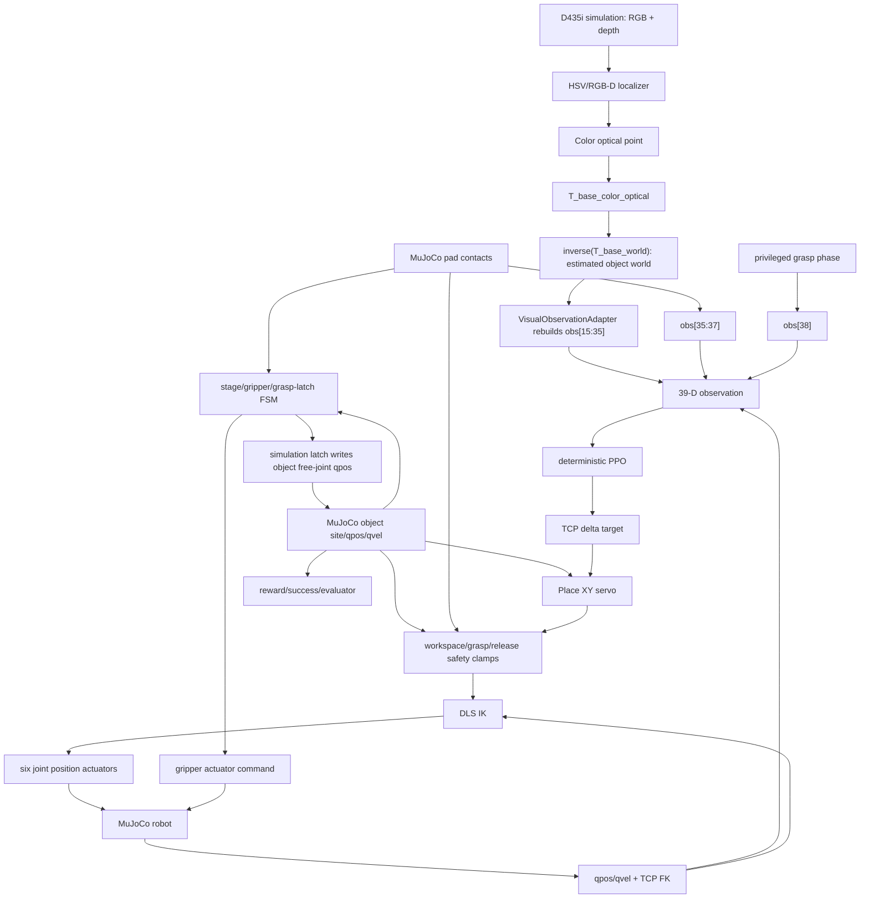

# Sim-to-Real privileged-state audit

## Scope and counting convention

This is a read-only audit of `/home/lenovo/mujoco_learning/08_camera` at the
state used by `My4C2AllStageSinglePPOV22Cube3cm-v0` and
`checkpoints/best_full_flow_v22.zip`. No controller, threshold, PPO, XML or
training code was changed.

The headline count is **19 unique runtime dependency groups**. A group is one
functional decision or actuation dependency, even if the same helper is called
several times. Reward-only and evaluator-only truth reads are listed separately
and are not included. The requested `/home/lenovo/mujoco_learning/07_test`
directory is absent on this machine; `06_4c2` was available for provenance
comparison. The current `allstage.py` has diverged from `06_4c2` (230 added and
13 removed lines), so this audit treats the current 08 implementation as
authoritative.

## Current control data flow

The important split is therefore not only truth versus vision inside PPO. The
PPO sees a visual object estimate, while Place servo, safety clamps, stage FSM,
gripper FSM and simulated latch still see the MuJoCo object directly.

## Interface-by-interface result

| Consumer | Current input | Result |
|---|---|---|
| PPO | `obs[15:35]` rebuilt from RGB-D/TCP tracker; `obs[35:39]` remains privileged | Partially visualized |
| Place servo | `data.site_xpos[object_site_id]` and goal site | Uses truth |
| FSM | true object geometry, MuJoCo contacts, penetration and simulated latch | Uses truth |
| IK | TCP target, joint qpos, TCP FK/Jacobian | No object truth directly |
| Safety layer | fixed workspace/table geometry plus true object geometry and release phase | Mixed |
| Reward/success | extensive object pose/velocity/contact truth | Simulation-only, except stage transitions are coupled to reward |

## Nineteen runtime privileged dependency groups

| ID | File / function | Read variable and source | Runtime effect | Deployable directly? | Category / recommended replacement |
|---|---|---|---|---|---|
| RT-01 | `fourc2/envs/allstage.py:_get_obs` | `left_contact/right_contact` from MuJoCo contact pairs; exposed as `obs[35:37]` | Changes PPO action | No | D: remove from policy or replace with gripper force/current/tactile estimator |
| RT-02 | `_get_obs`, `_update_grasp_phase` | normalized `grasp_phase`, whose transitions depend on truth geometry/contact | Changes PPO action through `obs[38]` | Not as currently defined | D/C: deployable FSM state must be rebuilt from commanded motion, visual/FK geometry and real gripper feedback |
| RT-03 | `_apply_tcp_action` lines around 949-1011 | `object_position = data.site_xpos[object_site_id]`; `goal_delta_xy` | Adds Place XY servo motion after PPO | No | B: feed the same tracked visual object estimate used by observation |
| RT-04 | `_apply_tcp_action`, `_place_release_phase` | true object-to-goal XY | Enables Place descent and changes XY/Z target shaping | No | B: estimated object-to-goal XY, with freshness/covariance gate |
| RT-05 | `_scripted_gripper_normalized`, `_release_should_open`, `_release_low_enough` | true object XY to goal and true object Z/lift | Opens gripper | No | B+C: tracked object estimate plus real gripper open/close feedback and timeout |
| RT-06 | `_safe_tcp_target_pos` Reach branch | true object Z + `pregrasp_height` | Clamps TCP Z target | No | B: estimated object Z; reject stale/invalid estimate |
| RT-07 | `_safe_tcp_target_pos` Grasp branch | true object XYZ and true pinch-object XY | Clamps TCP XY/Z and blocks descent | No | B: coherent visual/TCP-tracked estimate |
| RT-08 | `_safe_tcp_target_pos` Lift/Place branches | `object_initial_z` captured from truth and privileged release phase | Clamps lift/place/release Z | Not fully | B: visually initialized support/object height; fixed calibrated table plane; deployable FSM phase |
| RT-09 | `_update_grasp_phase`, `_pregrasp_handoff_ready` | `_pregrasp_position()` from true object plus TCP FK | ALIGN→DESCEND | No | B: estimated pregrasp position plus TCP FK |
| RT-10 | `_update_grasp_phase`, `_grasp_xy_aligned`, `_fine_grasp_close_allowed` | true object-derived grasp position | DESCEND→CLOSE or fallback | No | B: estimated grasp pose and uncertainty-aware tolerance logic |
| RT-11 | `_update_grasp_phase` CLOSE/CONFIRM | raw MuJoCo left/right contacts | Confirms closing or retries | No | C/D: motor current/force, finger position and optionally tactile sensing |
| RT-12 | `_check_grasp_success`, `_update_grasp_latch` | true pinch-object distance and true grasp XY/Z errors | Stable-grasp/latch qualification | No | B+C: visual/FK geometry before occlusion plus real gripper feedback after contact |
| RT-13 | `_check_grasp_success`, `_pad_object_contact_penetration` | bilateral contact truth and MuJoCo `contact.dist` penetration | Stable-grasp/latch qualification | No | D: eliminate penetration criterion; use force/current/tactile limits and finger travel |
| RT-14 | `_update_grasp_latch` | true object−TCP offset, true object position; directly writes object free-joint `qpos/qvel` | Artificially attaches and transports object | No real-world analogue | D: physical grasp replaces attachment; software tracker may propagate estimate but must never move a real object state |
| RT-15 | `_full_reward` Reach branch via `_get_info` | true pregrasp geometry and reach success | Reach→Grasp stage switch | No | B+A: estimated pregrasp geometry + TCP FK + tracking-error/time gate |
| RT-16 | `_full_reward` Grasp branch via `_check_grasp_success` | truth pose, contacts, penetration, latch | Grasp→Lift switch | No | C/D: gripper feedback-based grasp confirmation with timeout/recovery |
| RT-17 | `_full_reward` Lift branch via `_get_info` | true object lift, latch/contact, table contact/boundary | Lift→Place switch | No | B+C+A: TCP-propagated object estimate, gripper-hold feedback, robot collision state |
| RT-18 | `step`, `_get_info` Place success | true goal XY, object lift/Z, object XY velocity, contact and table boundary | Episode completion / stop | No | B+C: tracked estimate, settle timer, gripper feedback; task supervisor owns termination |
| RT-19 | `_get_info` stage failures | true object drift/orientation, contact penetration and robot-table contact | Terminates episode through `stage_failure` | Partially | C/D/A: robot protective-stop/collision feedback, real current/force limits; redesign object-tip/drift tests or make evaluator-only |

### Direct answer: Place servo data source

In `_apply_tcp_action`, Place reads
`self.data.site_xpos[self.object_site_id]` and
`self.data.site_xpos[self.goal_site_id]`, computes
`goal_delta_xy = (goal_position - object_position)[:2]`, and adds a bounded
`place_xy_servo_gain * goal_delta_xy` to the policy command in the default
`place_xy_control_mode="combined"`. It does **not** consume
`VisualObservationAdapter` output. The descent gate and release gate separately
read the same true object site. This is the most direct dual-source violation.

## Stage transitions and gripper/FSM inputs

The current V22 registration has `sequential_training=True`, starts every reset
in Reach, uses 39 dimensions and transitions inside `_full_reward`:

| Transition / command | Current predicate | Truth content |
|---|---|---|
| Reach→Grasp | pregrasp distance/XY/Z, TCP tracking, vertical alignment | pregrasp is built from true object site |
| ALIGN→DESCEND | `_pregrasp_handoff_ready` | true object-derived pregrasp |
| DESCEND→CLOSE | XY alignment and fine grasp error | true object-derived grasp point |
| CLOSE→CONFIRM | minimum close time + bilateral MuJoCo pad contact | contact truth |
| Grasp→Lift | stable grasp over multiple steps | true pose, contact, penetration, latch |
| Lift→Place | true object lift + latch/contact + table/boundary checks | extensive truth |
| Place descent | true object-to-goal XY | object site truth |
| Gripper release | step timer + true low-enough lift + true goal XY | object site truth |
| Place completion | open/unlatched + true XY/Z/speed + collision/boundary | extensive truth |

The PPO's fourth action is ignored for gripper actuation:
`_set_gripper_from_action()` always calls `_scripted_gripper_normalized()`.
Therefore the FSM, not PPO, owns all open/close decisions.

## PPO observation audit

| Slice | Meaning | RGB-D closed-loop source | Category |
|---|---|---|---|
| 0:6 | arm joint position | MuJoCo qpos; real joint encoder equivalent | A |
| 6:12 | arm joint velocity | MuJoCo qvel; real robot state equivalent | A |
| 12:15 | TCP/pinch position | FK from joints | A |
| 15:18 | object position | RGB-D then TCP propagation | B, already adapted |
| 18:21 | pregrasp position | rebuilt from estimate | B, already adapted |
| 21:24 | grasp position | rebuilt from estimate | B, already adapted |
| 24:27 | pinch→pregrasp | rebuilt from estimate + FK TCP | A+B |
| 27:30 | pinch→grasp | rebuilt from estimate + FK TCP | A+B |
| 30:33 | object→goal | rebuilt from estimate, preserving Place gate | B, already adapted |
| 33 | gripper state | normalized actuator command, not measured finger state | C: replace with SDK position/opening feedback |
| 34 | object lift | rebuilt from estimated initial Z and tracked estimate | B, already adapted |
| 35:37 | left/right pad contact | MuJoCo collision contact or forced true after latch | D/C: not migrated |
| 37:38 | vertical alignment | TCP FK axis versus desired axis | A, provided frames are calibrated |
| 38:39 | grasp phase | internal FSM derived partly from truth | D/C: not migrated |

## Post-grasp visual propagation audit

`scripts/eval_full_visual_closed_loop.py:VisualObjectTracker` initializes the
object in world coordinates from RGB-D. On the first
`env.is_grasp_latched`, it records
`R_tcp_world.T @ (estimated_object_world - tcp_world)` and thereafter computes
`tcp_world + R_tcp_world @ tcp_local_offset`. Thus, **after latch, the policy's
object estimate is propagated from the visual initialization and TCP FK and is
not corrected with object truth**.

Two qualifications block direct deployment:

1. The trigger `env.is_grasp_latched` is itself the privileged simulated latch.
2. In parallel, the environment's `_update_grasp_latch` uses the true object
   pose and writes the simulated object qpos. This changes simulated physics,
   while the policy tracker remains estimate-based.

So the project does contain the correct post-grasp estimator pattern, but its
handoff event must come from real gripper feedback, and the simulated qpos latch
must not be part of a real runtime.

## Safety audit

### Directly portable safety primitives

- fixed Cartesian workspace bounds;
- joint position bounds and actuator command clipping;
- DLS `dq` clipping;
- max TCP lead;
- TCP/table clearance from calibrated table geometry and FK;
- internal counters and timeouts.

### Not directly portable

- table collision from MuJoCo contact pairs;
- pad/object penetration depth;
- true object boundary, tip and drift tests;
- true object-based Reach/Grasp target clamps;
- the latch's direct object qpos clamp and table-boundary clamp.

Real deployment needs UR protective-stop/safety status, speed scaling, force or
current monitoring, calibrated keep-out volumes, watchdogs and a hardware E-stop.

## Reward, success and evaluator-only truth

These reads are category E when used only for training/evaluation:

- `_reach_reward`, `_grasp_reward`, `_lift_reward`, `_place_reward` shaping;
- object drift/speed/upright/penetration penalties;
- task success statistics and final object-to-goal error;
- RGB-D localization error against object site truth;
- evaluation drop/fling/contact diagnostics.

However `_full_reward` also mutates `self.stage`. Its Reach/Grasp/Lift success
predicates are therefore runtime controller inputs in this implementation and
are counted as RT-15 through RT-17. Deployment should separate a task supervisor
from training reward computation.

## A-E classification summary

### A. Can migrate through an interface

- PPO inference and deterministic action;
- joint position/velocity from UR5e state feedback;
- TCP pose, Jacobian and DLS IK from calibrated robot kinematics;
- joint actuator targets, subject to a real trajectory/servo interface;
- fixed goal coordinates, counters, timers, fixed workspace and table plane.

### B. Replaceable by vision or computation

- object pose and object-to-goal vector;
- pregrasp/grasp targets and all relative vectors;
- Place XY servo input and descent/release geometry;
- initial object/support height;
- post-grasp object propagation using visual TCP-object transform and TCP FK.

### C. Needs real robot/gripper feedback

- gripper opening/position and command completion;
- motor current, effort/force and stall/contact estimate;
- grasp-held/slip estimate;
- robot collision/protective-stop/safety state.

### D. Must be redesigned

- exact left/right MuJoCo contact flags as policy/FSM truth;
- contact penetration depth;
- simulated stable grasp and `is_grasp_latched` semantics;
- direct object qpos attachment;
- object true velocity/tip/drift as runtime safety/termination signals.

### E. Training/evaluation only

- reward shaping;
- simulator success labels;
- localization ground-truth error;
- drop/fling and final placement metrics.

## Does each dependency block deployment?

- RT-03 through RT-08 block correct motion/release because they directly alter
  the TCP or gripper command using unavailable truth.
- RT-09 through RT-18 block autonomous task sequencing because no real source
  currently drives equivalent state transitions.
- RT-01/02 block faithful PPO deployment because the trained policy still sees
  privileged contact/FSM dimensions.
- RT-19 blocks safe deployment because simulation collision truth is not a
  hardware safety system.
- Reward/evaluator truth does not block inference once stage switching is
  separated from reward.

## Priority-ordered minimum modification plan

1. Create one authoritative runtime `ObjectEstimate` and route it to Place
   servo, descent/release geometry and object-based safety clamps. Remove the
   PPO/servo dual source first.
2. Decouple stage transitions from `_full_reward`; create a task supervisor with
   explicit input interfaces and timeouts.
3. Define a `GripperFeedback` interface and replace MuJoCo bilateral contact,
   penetration and latch triggers. Keep the simulated implementation only as a
   backend for tests.
4. Switch post-grasp tracker handoff from `is_grasp_latched` to the real grasp
   confirmation event; preserve visual/TCP propagation.
5. Replace `obs[33]` and `obs[35:39]`, then rerun PPO sensitivity tests. If the
   policy depends strongly on unavailable fields, fine-tune/retrain only then.
6. Add camera calibration, robot/gripper drivers and independent hardware
   safety supervisor before any powered grasp.

## Honest current description

The project can honestly be called:

> A complete MuJoCo RGB-D-to-PPO manipulation evaluation with real DLS joint
> execution and a visual/TCP object estimator, while retaining a privileged
> simulation FSM, Place servo, grasp latch and safety/termination layer.

It cannot yet be called a truth-free sim-to-real controller or a directly
deployable UR5e+D435i grasp-and-place stack.

## Remaining distance to full Sim-to-Real

- eliminate the object-truth dual source in motion and sequencing;
- replace contact/latch/FSM semantics with measurable feedback;
- replace command-derived gripper state with actual SDK feedback;
- calibrate D435i intrinsics, depth scale, extrinsics and robot hand-eye chain;
- implement synchronized camera/joint timestamps;
- connect UR5e state and safe command interfaces;
- add production watchdog, speed/force limits, collision handling, timeout,
  E-stop and recovery;
- validate progressively with no-load, dummy-object and low-speed real grasps.
